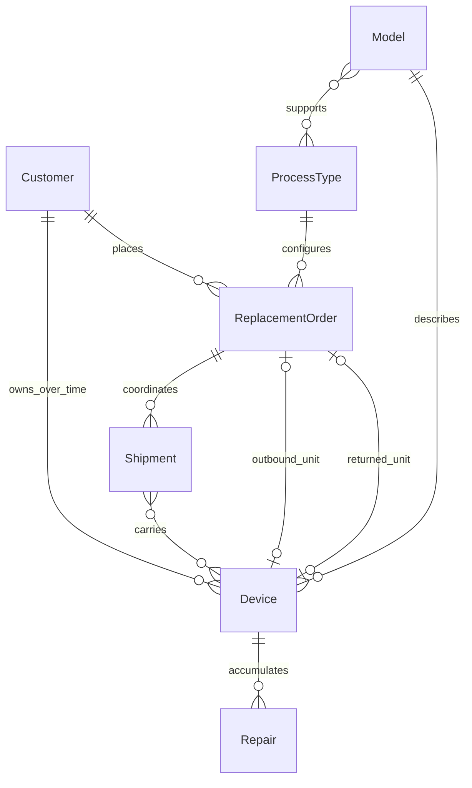
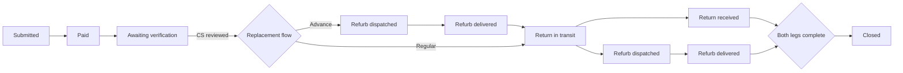

# Teracube Device Care — v2 Architecture Foundation

This document records the approved foundation for the v2 PRD. The PRD remains authoritative when implementation details conflict.

## Decisions

- One full-stack application: Next.js App Router with TypeScript.
- PostgreSQL is the system of record; Prisma will own schema and migrations beginning in Major Step 2.
- The application is Docker-compatible and avoids host-specific APIs. Production hosting can be selected near launch; Fly.io is the current recommendation.
- Customer and staff experiences use separate route groups and layouts inside the same application.
- External systems are accessed only through provider interfaces. Development and automated tests use deterministic in-memory mocks.
- Order state changes are event-driven. Routine status editing is not exposed in the UI.
- A physical device is permanent and serial-centric. Replacement orders, repairs, and shipments are distinct lifecycles.
- Phone and watch serials share the 15-character `YYYYMM + model code + unique number` structure. The registered model code determines device type.

## First-class entities

The outbound device link is deliberately optional because Shopify fulfillment may ship before the serial is known. Thrive can backfill it later.

## Replacement sequencing

Regular replacement has two independent progress legs after inbound tracking starts. The domain model therefore records return and refurb shipment progress separately rather than pretending one linear status can fully describe both.

## Route map

| Audience | Planned route family | Purpose |
| --- | --- | --- |
| Parent | `/repair/*` | Intake, checkout handoff, label, instructions, tracking |
| Support | `/staff/support/*` | Queue, verification, customers, merges, exceptions, refunds |
| Repair | `/staff/repair/*` | Receive, serial ledger, diagnosis, QC, batches, transfers |
| Logistics | `/staff/logistics/*` | Receive, dispatch, transfer labels |
| Ops Lead | `/staff/oversight/*` | All work, stale claims, stuck-unit alerts |
| Admin | `/staff/admin/*` | Teams, process types, policy, copy, timing configuration |
| APIs/webhooks | `/api/*` | REST resources, integration callbacks, health |

## Provider boundaries

- `CommerceProvider`: Shopify checkout, refunds, and automatic fulfillment.
- `ShippingProvider`: ShipSaving labels and tracking.
- `HelpdeskProvider`: Freshdesk ticket creation and threaded replies.
- `IdentityProvider`: Thrive identity resolution and outbound-serial backfill.
- `PlanProvider`: Gigs lookup by ICCID.
- `ObjectStorageProvider`: durable label and QR storage through an S3-compatible service.

## Security boundary

- Staff belong to one or more teams; effective permissions are the union of team permissions.
- PII is masked by default and every reveal becomes an audit event.
- Repair staff cannot reveal parent or child PII.
- Logistics can reveal an address only on demand; the reveal is audited.
- Raw payment card data never enters the application.
- Customer sessions are repair-scoped links/tokens, except trusted parent-app entry.

## Major-step boundaries

1. Architecture and domain contracts.
2. PostgreSQL schema, authentication, RBAC, PII policy, audit log.
3. Parent journey.
4. Support workflow and queue.
5. Repair workflow and serial ledger.
6. Logistics and shipments.
7. Mock adapters, webhooks, pollers, notifications, and automation.
8. Admin configuration, oversight, and reports.
9. Full testing, security, accessibility, and deployment packaging.
